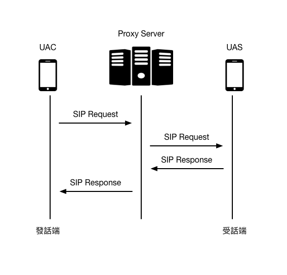
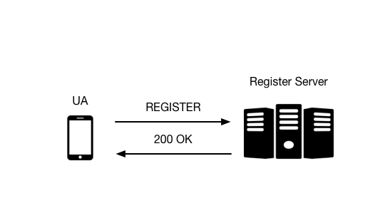

## SIP 簡介

### 前言

由於路由式 IP 網路的普及化，企業與個人都希望降低電信費用，我們何不利用 IP 網路的數據傳輸來實作語音服務呢？本篇是筆者研讀許多 VoIP 相關文件後所整理的筆記，透過 SIP 不僅可以實現通話及會議通訊功能，也同時擁有視訊會議與訊息傳輸的技術，不過你可能會想，若只局限於 PC to PC 間的通話，是否對於使用者來說方便性過於狹隘？但是對於這部份，筆者最後也整理了幾個 APP client 提供使用者作為參考，讓你的智慧型手機 (android、iOS) 也可以享有與 PC 相同的服務品質。

### UAC 與 UAS

SIP 網路元件可分為使用者代理器 (User Agents - UA) 與伺服器 (Server) 兩部分。其中 UA 又可細分為 UAC(User Agent Client) 與 UAS(User Agent Server)。UAC 負責建立請求，如：一個通話的開始，而 UAS 負責依照請求產生應答，如：接收通話。換而言之，每個 SIP User Agent 都包含 UAC 及 UAS ，如此一來每個終端設備都兼具接收與撥號功能。流程如下圖：



### Register Server

這個伺服器主要是接收 User Agent 註冊要求功能，並且提供 authentication (驗證)服務，通常與 Proxy 或 Redirect Server 放在一起，且更新 Location Server 上的 User Agent 資訊與位址。其流程如下：

1. Register Server 接收並處理使用者之註冊請求。
2. 使用者藉由註冊請求，向網路特定 Register Server 登錄該使用者連位址。
3. 註冊處理完成後，註冊伺服器將使用者之聯絡位址上傳至 Location Server 資料庫中儲存。



### Proxy Server

SIP Proxy 主要負責將 User Agent 或者其他 SIP Proxy 發送的請求代為傳遞到另一個 SIP 元件。當 User Agent 發出請求時，請求並非直接傳遞到目的地端的 User Agent ，而是經過一層層的 SIP Proxy 後才將請求訊息傳遞至目的地端。每個 SIP Prxoy 都會決定下一個路由並且對請求訊息做出適當加工處理後才傳遞。反之，目的地端回送訊息給發送端也是如此。

> SIP Proxy 事實上同時扮演 SIP Client 與 SIP Server 兩個角色，當他接受其他  Client 請求時，即為 SIP Server。當他轉送 SIP 請求至其他 Server 時，即為 SIP Client。

### Redirect Server

Redirect Server 目的是接受 SIP 的要求，將位址對應到零個或多個新的位址，並將結果回傳給 Client。

* 與 Proxy Server 不同，Redirect Server 並不會發出自己的 SIP 請求。
* 與 User Agent Server 不同，Redirect Server 並不會接受或結束一個通話。

### Location Server

當 Proxy Server 呼叫建立時，向 Location Server 查詢被呼叫者的聯絡位址，以轉送呼叫建立訊息。通常被 SIP Redirect 或 Proxy Server 所使用。

### SIP Gateways

1. 負責 SIP 協定和其他非 SIP 協定 (PSTN)轉換的橋樑
2. 負責語音通訊時資料傳送，將封包型態的數位資料轉換成類比訊號後，由 PSTN 網路傳送，或將類比資料轉成數位後在包裝成封包後，由 IP 網路傳送出去。

## SIP 特點

* **簡單** : SIP 通訊協定與 HTTP 通訊協定類似，都是採用請求 (Requests) 與回應 (Responses) 模式，提供數種命令與回應代碼來完成呼叫控制。
* **以文字為主** : 類似 HTTP 的作法，將協定的訊息以文字表達並使用標準的字元編碼，如 ASCII 、 UTF-8 ，運用這個方式的好處是容易實作與偵錯、擴充性佳、增加額外訊息不需大幅更動原有解析程式。
* **與傳輸層分離** : SIP 運作在傳輸層之上，可以提昇網路傳輸的適應性和支援性。在封包容易遺失的環境下使用 TCP 連線，而在環境叫穩定的狀況下使用 UDP。
* **支援移動性** : SIP 在制定時，就已經將支援移動性納入考量，就算使用者在呼叫階段或是交談過程中，都可以藉由轉送或是重新邀請來維持會談。

## SIP 相關的網路協定

* **SDP (會談描述協定)** : 此協定主要用來協商雙方建立多媒體資料封包通道之用，雙方會在邀請 (INVITE) 訊息的三向交握過程中交換彼此可以使用的通訊方式及資料格式。
* **RTP (即時傳輸協定)** : 此協定用於即時資料傳輸，如影像資料...等，由於 VoIP 所傳輸的多媒體資料大多屬於即時性優先於資料完整性，所以利用 RTP 的特性來編排及傳遞這些資料內容最適合。
* **LDAP (輕量及目錄訪問協定)** : 此協議主要是讓 SIP Server 用來與位址服務的伺服器溝通，以取得每個目的的正確位址。

## SIP 請求 (Requests) 與回應 (Responses)
### SIP 請求
SIP 的六項基本的方法向伺服器發出請求，以下簡單敘述：

| 方法 | 敘述 | 
| :--: | :---| 
| INVITE | 邀請建立會議(Session) |
| ACK | 回覆確認邀請(INVITE)的回覆已收到 |
| OPTIONS | 用來傳送 midcall訊號(mid-session 資訊)並不改變 Session 狀態 | 
| BYE | 結束一個已連結的 Session |
| CANCEL | 取消一個已發出邀請但尚未連結的 Session |
| REGISTER | 註冊使用者的 URL |

### SIP 回應

SIP Responses 訊息包含一個三個位數的狀態碼 (status code)，用來表示回應原因：

* **1XX** - Information Messages. (訊息通知，請求處理中尚未完成。)
* **2XX** - Successful Responses. (請求處理成功。)
* **3XX** - Redirection Responses. (重新導向，將請求訊息重新導向至另一個 SIP 元件。)
* **4XX** - Request Failure Responses. (客戶端錯誤，錯誤的原因在於請求端。可以矯正後重試。)
* **5XX** - Server Failure Responses. (伺服器端錯誤，錯誤的原因在於目的端。可以重試其他的 location。)
* **6XX** - Global Failure Responses. (錯誤 - Global Error ，請求失敗且無法重試。)

| 代碼  | 敘述    | 代碼  | 敘述         | 
| :--: | :------ | :--: | :-----------| 
| 100  | 正在嘗試 | 305  | 使用代理伺服器 |
| 180  | 正在撥打 | 380  | 替代服務      |
| 181  | 正在轉接 | 400  | 呼叫不當      |
| 182  | 正在排隊 | 401  | 未經授權      |
| 183  | 通話進展 | 402  | 要求付費      |
| 200  | OK      | 403  | 被禁止的      |
| 202  | 被接受   | 404  | 未發現用戶    |
| 300  | 多項選擇 | 405  | 不允許的方法   |
| 301  | 被永久遷移| 406  | 不可接受的    |
| 302  | 被暫時遷移| 407  | 需要代理伺服器授權 |

| 代碼  | 敘述    | 代碼  | 敘述         | 
| :--: | :------ | :--: | :-----------| 
| 408  | 呼叫超時 | 481  | 通話/事務不存在 |
| 410  | 用戶曾經存在，但現在不存在 | 482  | 檢測到迴圈 |
| 413  | 呼叫實體過大 | 483  | 跳數過多 |
| 414  | 呼叫 URI 過長 | 484  | 位址不全 |
| 415  | 不支援的媒體類型 | 485  | 模糊不清 |
| 416  | 不支援的 URI 方案 | 486  | 忙碌中 |
| 420  | 不當擴展 | 487  | 呼叫被終止 |
| 421  | 需要擴展 | 488  | 此處不可接受 |
| 423  | 時間間隔過短 | 491  | 呼叫待批 |
| 480  | 暫時不可以使用 | 493  | 無法解讀 |

| 代碼  | 敘述    | 
| :--: | :------ |
| 500  | 伺服器內部錯誤 |
| 501  | SIP 呼叫方法在此無法實施 |
| 502  | 不當閘道 |
| 503  | 服務不可使用 |
| 504  | 伺服器超時 |
| 505  | 伺服器不支援 SIP 協定的這個版本 |
| 513  | 消息過長 |
| 600  | 各處忙碌 | 
| 603  | 拒絕 | 
| 604  | 無處存在 |
| 605  | 不可使用 |

## SIP 流程

由下圖可知，當 Client 1 撥打電話給 Client 2 時，會先發送 INVITE 請求並且與 Client 1 請求代理伺服器授權。當前置動作完成以後， SIP Server 會發送 INVITE 給 Client 2 ，此時雙方的電話將會響起，假設雙方都接受電話請求，此時開始進行對話。最後，當一方送出 BYE 訊息時，系統會執行通話終止，並且同時送出 BYE 訊息給另一方結束此次通話。


## SIP 安裝教學

#### 作業系統與 SIP 套件：

*   Ubuntu - 14.04
*   OpenSIPS - 2.1
*   Openstack -  

| 主機 | Private IP | Floating IP |
| :--: | :------: | :-----: |
| SIP Server | 192.168.100.174 | 10.26.1.25 |


#### 更新 apt-get：

```
sudo apt-get update
```

#### 下載安裝相關套件：

```
sudo apt-get install -y git make bison flex mysql-server mysql-client libmysqlclient-dev libncurses5 libncurses5-dev
```

#### 下載 OpenSIPS 套件:

```
cd ~/
sudo git clone https://github.com/OpenSIPS/opensips.git -b 2.1 opensips_2_1
```

#### 修改配置檔：

```
sudo vim ~/opensips_2_1/Makefile.conf.tmplate
```
> 移除 exclude_modules 中 db\_mysql 並儲存

#### 安裝OpenSIPS：

```
cd ~/opensips_2_1
sudo make all
sudo make install
```

#### 安裝完畢後，修改部分opensipsctlrc文件，如下：

   
```
sudo vim /usr/local/etc/opensips/opensipsctlrc

修改如下，將部分註解刪除

## your SIP domain
SIP_DOMAIN=ubuntustudio
## chrooted directory
# $CHROOT_DIR="/path/to/chrooted/directory"
## database type: MYSQL, PGSQL, ORACLE, DB_BERKELEY, or DBTEXT, 
## by default none is loaded
# If you want to setup a database with opensipsdbctl, you must at least specify
# this parameter.
DBENGINE=MYSQL
## database host
DBHOST=localhost
## database name (for ORACLE this is TNS name)
DBNAME=opensips
# database path used by dbtext or db_berkeley
DB_PATH="/usr/local/etc/opensips/dbtext"
## database read/write user
DBRWUSER=opensips
## password for database read/write user
DBRWPW="opensipsrw"
## database super user (for ORACLE this is 'scheme-creator' user)
DBROOTUSER="root"
# user name column
USERCOL="username"
```
	
> 若出現 `ERROR: database engine not specified, please setup one in the config script` 錯誤，請修改 /usr/local/etc/opensips 權限。

#### 執行建立資料庫腳本：
   
```
/usr/local/sbin/opensipsdbctl create

```

> 你會看到如下方結果：
> 
```
MySQL password for root: 
INFO: test server charset
INFO: creating database opensips ...
INFO: Core OpenSIPS tables succesfully created.
Install presence related tables? (y/n): y  
INFO: creating presence tables into opensips ...
INFO: Presence tables succesfully created.
Install tables for imc cpl siptrace domainpolicy carrierroute userblacklist? (y/n): y
INFO: creating extra tables into opensips ...
INFO: Extra tables succesfully created.
```	
> 如果執行出現錯誤，可以從 /var/log/syslog 檢視錯誤資訊。

##### 常見錯誤：
* var/run 路徑權限不足

```
sudo chmod 777 /var
sudo chmod 777 /var/run
```
* opensips.cfg 權限不足

```
sudo chmod 755 /usr/local/etc/opensips/opensips.cfg
```

#### 設定 OpenSIPs listen：
使用你慣用的編輯軟體如: vim ，開啟 /usr/local/etc/opensips/opensips.cfg 進行設定。

``` 
...
advertised_address="10.26.1.25"
alias="10.26.1.25"

listen=udp:192.168.100.174:5060
...
```

> 若你想在 AWS EC2 或 Openstack Instance 佈署 OpenSIPS 服務，請務必加入 advertised_address 與 alias ，如此一來你的服務才能夠被正確的對應出來。如果你使用的是 EC2 請輸入 Public IP ，如果你使用的是 Openstack Instance 請輸入 Floating IPs。

#### 新增 Domain 至資料庫中：
首先使用 `mysql -u root -p` 指令並輸入密碼後進入 MySQL ，接下來，透過以下指令建立 Domain 至 opensips.domain 資料表。

```
INSERT INTO opensips.domain(domain) VALUES('192.168.100.174');
```

並且可以透過搜尋語法，確認是否有將該筆資料新增進資料表中。

```
SELECT * FROM opensips.domain;
```

最後，離開 MySQL。

```
exit;
```

#### OpenSIPS 操作：
啟動：

```
/usr/local/sbin/opensipsctl start
```
	
暫停：

```
/usr/local/sbin/opensipsctl stop
```
	
重新啟動：

```
/usr/local/sbin/opensipsctl restart
```
	
> 如果執行時出現錯誤，請檢查 opensips.cfg 、 /var 與 /var/run 權限是否有誤。

## 用戶端軟體

* Mac OS : [Yate Client](http://yateclient.yate.ro/)、Zoiper
* Android : ECOA Sip (可至 Play 商店下載)
* iOS :  Zoiper (可至 App Store 下載)

> 以上為筆者列舉幾項作為示範，若需要更多相關用戶端軟體可至 [open source VOIP Software](http://www.voip-info.org/wiki/view/Open+Source+VOIP+Software) 取得。


