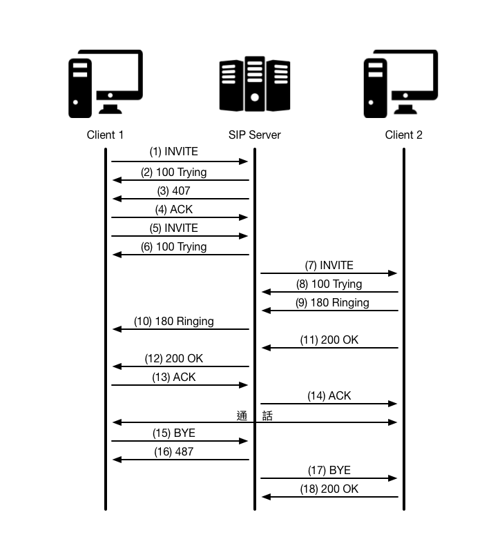

## SIP 簡介

由於路由式 IP 網路的普及化，企業與個人都希望降低電信費用，我們何不利用 IP 網路的數據傳輸來實作語音服務呢？本篇是筆者研讀許多 VoIP 相關文件後所整理的筆記，透過 SIP 不僅可以實現通話及會議通訊功能，也同時擁有視訊會議與訊息傳輸的技術，不過你可能會想，若只局限於 PC to PC 間的通話，是否對於使用者來說方便性過於狹隘？但是對於這部份，筆者最後也整理了幾個 APP client 提供使用者作為參考，讓你的智慧型手機(android、iOS)也可以享有與 PC 相同的服務品質。

## SIP 特點

* **簡單** : SIP 通訊協定與 HTTP 通訊協定類似，都是採用請求 (Requests) 與回應 (Responses) 模式，提供數種命令與回應代碼來完成呼叫控制。
* **以文字為主** : 類似 HTTP 的作法，將協定的訊息以文字表達並使用標準的字元編碼，如 ASCII 、 UTF-8 ，運用這個方式的好處是容易實作與偵錯、擴充性佳、增加額外訊息不需大幅更動原有解析程式。
* **與傳輸層分離** : SIP 運作在傳輸層之上，可以提昇網路傳輸的適應性和支援性。在封包容易遺失的環境下使用 TCP 連線，而在環境叫穩定的狀況下使用 UDP。
* **支援移動性** : SIP 在制定時，就已經將支援移動性納入考量，就算使用者在呼叫階段或是交談過程中，都可以藉由轉送或是重新邀請來維持會談。

## SIP 相關的網路協定

* **SDP (會談描述協定)** : 此協定主要用來協商雙方建立多媒體資料封包通道之用，雙方會在邀請 (INVITE) 訊息的三向交握過程中交換彼此可以使用的通訊方式及資料格式。
* **RTP (即時傳輸協定)** : 此協定用於即時資料傳輸，如影像資料...等，由於 VoIP 所傳輸的多媒體資料大多屬於即時性優先於資料完整性，所以利用 RTP 的特性來編排及傳遞這些資料內容最適合。
* **LDAP (輕量及目錄訪問協定)** : 此協議主要是讓 SIP Server 用來與位址服務的伺服器溝通，以取得每個目的的正確位址。

## SIP 請求 (Requests) 與回應 (Responses)
### SIP 請求
SIP 的六項基本的方法向伺服器發出請求，以下簡單敘述：

| 方法     | 敘述  | 
| :-----: | :------------------ | 
| INVITE  | 建立通話請求          |
| ACK     | 確認 INVITE 完成     |
| OPTIONS | 查詢狀態與其他相關資訊 | 
| BYE     | 終止通話             |
| CANCEL  | 取消正在請求的通話     |
| REGISTER| 註冊使用者            |

### SIP 回應
SIP 回應分成 Provisional (暫時)及 Final (決定)兩類，Provisional 為 1XX ， Final 則包含 2XX ~ 6XX 。1XX 為通知性應答、 2XX 為成功應答、 3XX 為轉接應答、 4XX 為呼叫錯誤、 5XX 為伺服器錯誤、 6XX 為全局錯誤。

| 代碼  | 敘述    | 代碼  | 敘述         | 
| :--: | :------ | :--: | :-----------| 
| 100  | 正在嘗試 | 305  | 使用代理伺服器 |
| 180  | 正在撥打 | 380  | 替代服務      |
| 181  | 正在轉接 | 400  | 呼叫不當      |
| 182  | 正在排隊 | 401  | 未經授權      |
| 183  | 通話進展 | 402  | 要求付費      |
| 200  | OK      | 403  | 被禁止的      |
| 202  | 被接受   | 404  | 未發現用戶    |
| 300  | 多項選擇 | 405  | 不允許的方法   |
| 301  | 被永久遷移| 406  | 不可接受的    |
| 302  | 被暫時遷移| 407  | 需要代理伺服器授權 |

| 代碼  | 敘述    | 代碼  | 敘述         | 
| :--: | :------ | :--: | :-----------| 
| 408  | 呼叫超時 | 481  | 通話/事務不存在 |
| 410  | 用戶曾經存在，但現在不存在 | 482  | 檢測到迴圈 |
| 413  | 呼叫實體過大 | 483  | 跳數過多 |
| 414  | 呼叫 URI 過長 | 484  | 位址不全 |
| 415  | 不支援的媒體類型 | 485  | 模糊不清 |
| 416  | 不支援的 URI 方案 | 486  | 忙碌中 |
| 420  | 不當擴展 | 487  | 呼叫被終止 |
| 421  | 需要擴展 | 488  | 此處不可接受 |
| 423  | 時間間隔過短 | 491  | 呼叫待批 |
| 480  | 暫時不可以使用 | 493  | 無法解讀 |

| 代碼  | 敘述    | 
| :--: | :------ |
| 500  | 伺服器內部錯誤 |
| 501  | SIP 呼叫方法在此無法實施 |
| 502  | 不當閘道 |
| 503  | 服務不可使用 |
| 504  | 伺服器超時 |
| 505  | 伺服器不支援 SIP 協定的這個版本 |
| 513  | 消息過長 |
| 600  | 各處忙碌 | 
| 603  | 拒絕 | 
| 604  | 無處存在 |
| 605  | 不可使用 |

## SIP 工作流程

由下圖可知，當 Client 1 撥打電話給 Client 2 時，會先發送 INVITE 請求並且與 Client 1 請求代理伺服器授權。當前置動作完成以後， SIP Server 會發送 INVITE 給 Client 2 ，此時雙方的電話將會響起，假設雙方都接受電話請求，此時開始進行對話。最後，當一方送出 BYE 訊息時，系統會執行通話終止，並且同時送出 BYE 訊息給另一方結束此次通話。



## SIP 安裝教學

#### 作業系統與 SIP 套件：

*   Ubuntu - 14.04 Server
*   OpenSIPS - 2.1 

| 主機  | IP 位址    | 
| :--: | :------: |
| SIP Server | 10.21.20.111 |


#### 更新 apt-get：

```
sudo apt-get update
```

#### 下載安裝相關套件：

```
sudo apt-get install git make bison flex & 
mysql-server mysql-client libmysqlclient-dev &
libncurses5 libncurses5-dev 
```

#### 下載 OpenSIPS 套件:

```
cd ~/
sudo git clone https://github.com/OpenSIPS/opensips.git -b 2.1 opensips_2_1
```

#### 修改配置檔：

```
sudo nano ~/opensips_2_1/Makefile.conf.tmplate
```
> 移除 exclude_modules 中 db\_mysql 並儲存

#### 安裝OpenSIPS：

```
cd ~/opensips_2_1
sudo make all
sudo make install
```

#### 安裝完畢後，修改部分opensipsctlrc文件，如下：

   
```
sudo nano /usr/local/etc/opensips/opensipsctlrc

修改如下，將部分註解刪除

## your SIP domain
SIP_DOMAIN=ubuntustudio
## chrooted directory
# $CHROOT_DIR="/path/to/chrooted/directory"
## database type: MYSQL, PGSQL, ORACLE, DB_BERKELEY, or DBTEXT, 
## by default none is loaded
# If you want to setup a database with opensipsdbctl, you must at least specify
# this parameter.
DBENGINE=MYSQL
## database host
DBHOST=localhost
## database name (for ORACLE this is TNS name)
DBNAME=opensips
# database path used by dbtext or db_berkeley
DB_PATH="/usr/local/etc/opensips/dbtext"
## database read/write user
DBRWUSER=opensips
## password for database read/write user
DBRWPW="opensipsrw"
## database super user (for ORACLE this is 'scheme-creator' user)
DBROOTUSER="root"
# user name column
USERCOL="username"
```
	
> 如果出現沒有權限修改 opensipsctlrc 請先修改 /usr/local/etc/opensips 權限

#### 執行建立資料庫腳本：
   
```
/usr/local/sbin/opensipsdbctl create

```

> 你會看到如下方結果：
> 
```
MySQL password for root: 
INFO: test server charset
INFO: creating database opensips ...
INFO: Core OpenSIPS tables succesfully created.
Install presence related tables? (y/n): y  
INFO: creating presence tables into opensips ...
INFO: Presence tables succesfully created.
Install tables for imc cpl siptrace domainpolicy carrierroute userblacklist? (y/n): y
INFO: creating extra tables into opensips ...
INFO: Extra tables succesfully created.
```	
> 如果執行出現錯誤，可以從 /var/log/syslog 檢視錯誤資訊。

##### 常見錯誤：
* var/run 路徑權限不足

```
sudo chmod 777 /var
sudo chmod 777 /var/run
```
* opensips.cfg 權限不足

```
sudo chmod 755 /usr/local/etc/opensips/opensips.cfg
```

#### 設定 OpenSIPs listen：
使用你慣用的編輯軟體如: vim ，開啟 /usr/local/etc/opensips/opensips.fcg 進行設定。

``` 
...
listen=udp:10.21.20.111:5060
...
```

#### 新增 Domain 至資料庫中：
首先進入 MySQL ，並且輸入下列指令建立 Domain 至 opensips.domain 資料表。

```
INSERT INTO opensips.domain(domain) VALUES('10.21.20.111');
```

並且可以透過搜尋語法，確認是否有將該筆資料新增進資料表中。

```
SELECT * FROM opensips.domain;
```

最後，離開 MySQL。

```
exit;
```

#### OpenSIPS 操作：
啟動：

```
/usr/local/sbin/opensipsctl start
```
	
暫停：

```
/usr/local/sbin/opensipsctl stop
```
	
重新啟動：

```
/usr/local/sbin/opensipsctl restart
```
	
> 如果執行時出現錯誤，請檢查 opensips.cfg 、 /var 與 /var/run 權限是否有誤。

## 用戶端軟體

* Mac OS : [Yate Client](http://yateclient.yate.ro/)、Zoiper
* Android : ECOA Sip (可至 Play 商店下載)
* iOS :  Zoiper (可至 App Store 下載)

> 以上為筆者列舉幾項作為示範，若需要更多相關用戶端軟體可至 [open source VOIP Software](http://www.voip-info.org/wiki/view/Open+Source+VOIP+Software) 取得。


